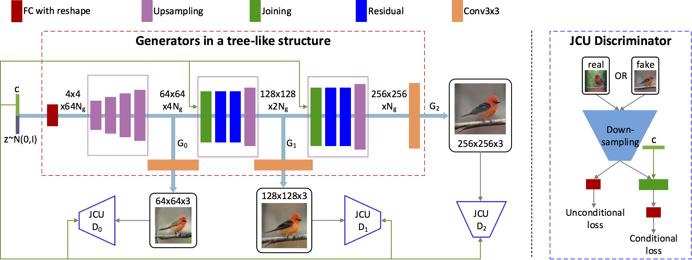

# StackGAN-v2

Pytorch implementation for reproducing StackGAN_v2 results in the paper [StackGAN++: Realistic Image Synthesis with Stacked Generative Adversarial Networks](https://arxiv.org/abs/1710.10916) by Han Zhang*, Tao Xu*, Hongsheng Li, Shaoting Zhang, Xiaogang Wang,   Xiaolei Huang, Dimitris Metaxas.

### Dependencies
python 3.6

Pytorch

In addition, please add the project folder to PYTHONPATH and `pip install` the following packages:
- `tensorboardX` or `pytorch-tensorbord`

**Data**

1. Download our preprocessed char-CNN-RNN text embeddings for [birds](https://drive.google.com/open?id=0B3y_msrWZaXLT1BZdVdycDY5TEE) and save them to `data/`
  - [Optional] Follow the instructions [reedscot/icml2016](https://github.com/reedscot/icml2016) to download the pretrained char-CNN-RNN text encoders and extract text embeddings.
2. Download the [birds](http://www.vision.caltech.edu/visipedia/CUB-200-2011.html) image data. Extract them to `data/birds/`

**Training**

- Train a StackGAN-v2 model on the bird (CUB) dataset using our preprocessed embeddings:
  -  `python main.py --cfg cfg/birds_3stages.yml --gpu 0`

- If you want to try your own datasets, [here](https://github.com/soumith/ganhacks) are some good tips about how to train GAN. Also, we encourage to try different hyper-parameters and architectures, especially for more complex datasets.

**Pretrained Model**
- [StackGAN-v2 for bird](https://drive.google.com/open?id=1s5Yf3nFiXx0lltMFOiJWB6s1LP24RcwH). Download and save it to `models/` (The [inception score](https://github.com/hanzhanggit/StackGAN-inception-model) for this Model is 4.04±0.05)

**Evaluating**
- Run `python main.py --cfg cfg/eval_birds.yml --gpu 1` to generate samples from captions in birds validation set.
- Change the `eval_*.yml` files to generate images from other pre-trained models. 

**Examples generated by StackGAN-v2**

Tsne visualization of randomly generated [birds](https://github.com/hanzhanggit/StackGAN-v2/blob/master/examples/bird_res256_grid50x50.jpg), [dogs](https://github.com/hanzhanggit/StackGAN-v2/blob/master/examples/dog_res256_grid50x50.jpg), [cats](https://github.com/hanzhanggit/StackGAN-v2/blob/master/examples/cat_res256_grid50x50.jpg), [churchs](https://github.com/hanzhanggit/StackGAN-v2/blob/master/examples/church_res256_grid50x50.jpg) and [bedrooms](https://github.com/hanzhanggit/StackGAN-v2/blob/master/examples/bedroom_res256_grid50x50.jpg)

**References**

- Generative Adversarial Text-to-Image Synthesis [Paper](https://arxiv.org/abs/1605.05396) [Code](https://github.com/reedscot/icml2016)
- Learning Deep Representations of Fine-grained Visual Descriptions [Paper](https://arxiv.org/abs/1605.05395) [Code](https://github.com/reedscot/cvpr2016)

