# StackGAN-v2 revision for Colab

This is StackGAN_v2 revised version for Google Colab.

Refer to [https://github.com/hanzhanggit/StackGAN-v2](https://github.com/hanzhanggit/StackGAN-v2) for original source version,  
it is implementation for the paper [StackGAN++: Realistic Image Synthesis with Stacked Generative Adversarial Networks](https://arxiv.org/abs/1710.10916).

Refer to troubleshooting [issues](https://github.com/rightlit/StackGAN-v2-rev/issues) while running with original source 

### Dependencies
python 3.6

Pytorch 1.7.0+cu101

In addition, please add the project folder to PYTHONPATH and `pip install` the following packages:
- `tensorboardX == 1.1` 

**Data**

1. Download our preprocessed char-CNN-RNN text embeddings for [birds](https://drive.google.com/open?id=0B3y_msrWZaXLT1BZdVdycDY5TEE) and [flowers](https://drive.google.com/open?id=0B3y_msrWZaXLaUc0UXpmcnhaVmM) and save them to `Data/`
  - [Optional] Follow the instructions [reedscot/icml2016](https://github.com/reedscot/icml2016) to download the pretrained char-CNN-RNN text encoders and extract text embeddings.
2. Download the [birds](http://www.vision.caltech.edu/visipedia/CUB-200-2011.html) and [flowers](http://www.robots.ox.ac.uk/~vgg/data/flowers/102/) image data. Extract them to `Data/birds/` and `Data/flowers/`, respectively.

**Evaluating**
- Run `python main.py --cfg cfg/eval_birds.yml --gpu 1` to generate samples from captions in birds validation set.
- Run `python main.py --cfg cfg/eval_flowers.yml --gpu 1` to generate samples from captions in flowers validation set.
- Change the `eval_*.yml` files to generate images from other pre-trained models. 

**Examples generated by StackGAN-v2**

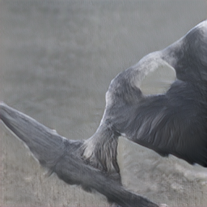
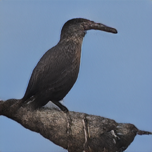
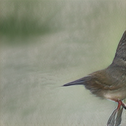

- the medium sized bird has a dark grey color, a black downward curved beak, and long wings.
- the bird is dark grey brown with a thick curved bill and a flat shaped tail.
- bird has brown body feathers, white breast feathers and black beak

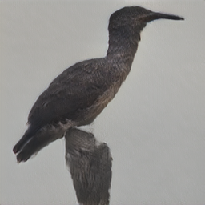
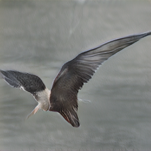
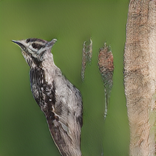

- this bird has a dark brown overall body color, with a small white patch around the base of the bill.
- the bird has very long and large brown wings, as well as a black body and a long black beak.
- it is a type of albatross with black wings, tail, back and beak, and has a white ring at the base of its beak.

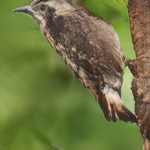
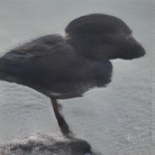
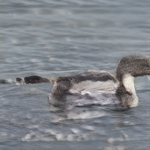

- this bird has brown plumage and a white ring at the base of its long, curved brown beak.
- the entire body is dark brown, as is the bill, with a white band encircling where the bill meets the head.
- this bird is gray in color, with a large curved beak.

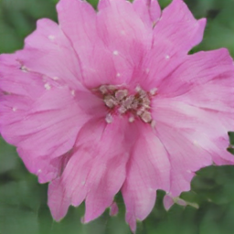
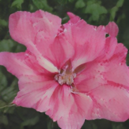
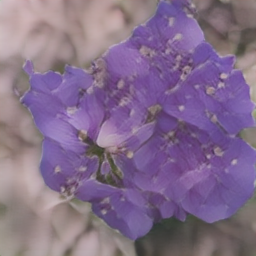

- the petals of the flower are pink in color and have a yellow center.
- this flower is pink and white in color, with petals that are multi colored.
- the geographical shapes of the bright purple petals set off the orange stamen and filament and the cross shaped stigma is beautiful.

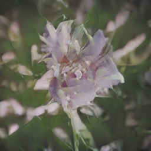
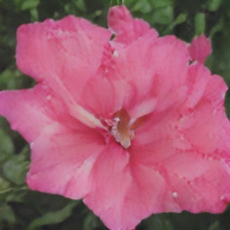
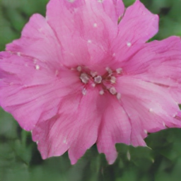

- the purple petals have shades of white with white anther and filament
- this flower has large pink petals and a white stigma in the center
- this flower has petals that are pink and has a yellow stamen

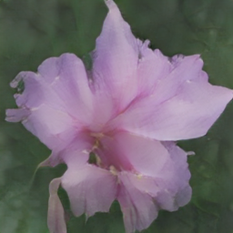
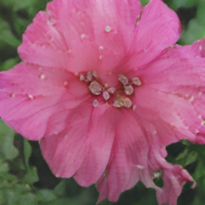
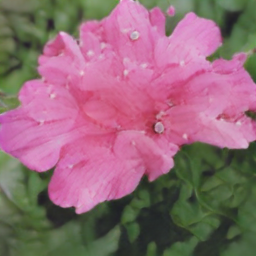

- a flower with short and wide petals that is light purple.
- this flower has small pink petals with a yellow center.
- this flower has large rounded pink petals with curved edges and purple veins.

Tsne visualization of randomly generated [birds](https://github.com/hanzhanggit/StackGAN-v2/blob/master/examples/bird_res256_grid50x50.jpg), [dogs](https://github.com/hanzhanggit/StackGAN-v2/blob/master/examples/dog_res256_grid50x50.jpg), [cats](https://github.com/hanzhanggit/StackGAN-v2/blob/master/examples/cat_res256_grid50x50.jpg), [churchs](https://github.com/hanzhanggit/StackGAN-v2/blob/master/examples/church_res256_grid50x50.jpg) and [bedrooms](https://github.com/hanzhanggit/StackGAN-v2/blob/master/examples/bedroom_res256_grid50x50.jpg)

**References**

- Generative Adversarial Text-to-Image Synthesis [Paper](https://arxiv.org/abs/1605.05396) [Code](https://github.com/reedscot/icml2016)
- Learning Deep Representations of Fine-grained Visual Descriptions [Paper](https://arxiv.org/abs/1605.05395) [Code](https://github.com/reedscot/cvpr2016)

